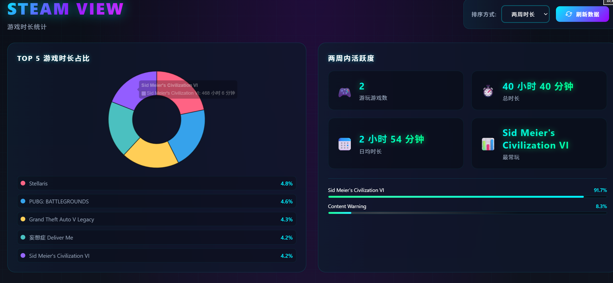
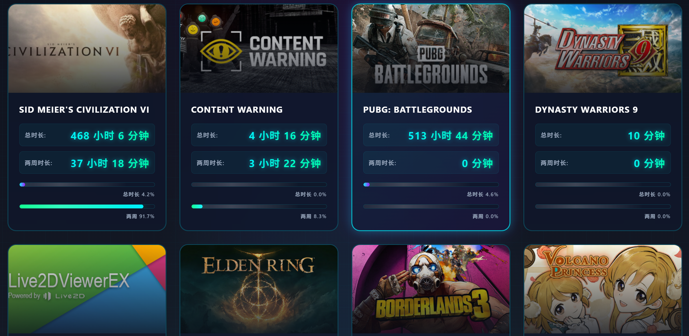

# Steam View

一个用于 Halo 博客系统的 Steam 游戏库展示插件，可以展示用户的 Steam 游戏数据、游戏时长统计等信息。


## ✨ 功能特性

- 🎮 **游戏数据展示**
  - 展示 Steam 游戏库中的所有游戏
  - 支持家庭库游戏（Family Sharing）
  - 游戏封面、名称、时长等信息
  - 游戏名称本地化（支持中文）

- 📊 **数据可视化**
  - 环形图：Top 5 游戏时长占比
  - 统计卡片：两周内活跃度统计
  - 进度条：游戏时长占比可视化
  - 双进度条设计：总时长 + 两周时长

- 🔧 **排序功能**
  - 按两周时长排序（默认）
  - 按总时长排序
  - 按游戏名称排序
  - 按最近游玩时间排序

- 🎨 **用户体验**
  - 响应式设计（支持桌面端、平板、移动端）
  - 赛博朋克风格界面
  - 加载动画和成功提示
  - 返回首页按钮
  - 分页显示（默认12个游戏，支持加载更多）

- ⚙️ **配置管理**
  - Steam API Key 配置
  - Steam ID 配置
  - 数据刷新频率设置
  - 隐藏游戏功能
  - 测试连接功能

## 📸 截图





## 🚀 快速开始

### 环境要求

- Halo 2.21.0 或更高版本
- Java 21+

### 安装方法

#### 方法1：通过 Halo 后台安装

1. 登录 Halo 后台
2. 进入"插件" → "安装插件"
3. 上传 `build/libs/pluginsteamview-1.0.0-SNAPSHOT.jar`
4. 启用插件

#### 方法2：手动安装

1. 下载最新版本的 jar 文件
2. 将 jar 文件复制到 Halo 的插件目录：
   ```bash
   cp pluginsteamview-1.0.0-SNAPSHOT.jar /path/to/halo/plugins/
   ```
3. 重启 Halo

### 配置插件

1. 进入 Halo 后台
2. 进入"插件" → "Steam View" → "设置"
3. 填写以下信息：
   - **Steam API Key**: 在 [Steam API Key 申请页面](https://steamcommunity.com/dev/apikey) 获取
   - **Steam ID**: 你的 Steam ID（17位数字），可以在 Steam 个人主页 URL 中找到
4. 点击"测试 Steam 连接"验证配置
5. 保存设置

### 访问插件

配置完成后，访问以下地址查看你的 Steam 游戏数据：

```
http://your-halo-domain/steamview
```

## 🛠️ 开发

### 环境要求

- Java 21+
- Node.js 18+
- pnpm 10.12.4+

### 开发步骤

1. **克隆项目**
   ```bash
   git clone https://gitee.com/miku-0410/steam-view.git
   cd steam-view
   ```

2. **安装前端依赖**
   ```bash
   cd ui
   pnpm install
   ```

3. **启动开发服务器**
   
   在项目根目录启动 Halo 开发服务器：
   ```bash
   ./gradlew.bat haloServer
   ```
   
   在 `ui` 目录启动前端开发服务器（新终端）：
   ```bash
   cd ui
   pnpm dev
   ```

4. **访问应用**
   ```
   http://localhost:8090/console
   http://localhost:8090/steamview
   ```

### 构建

```bash
# 构建整个项目
./gradlew.bat build

# 构建产物位置
build/libs/pluginsteamview-1.0.0-SNAPSHOT.jar
```

### 开发命令

```bash
# 清理构建缓存
./gradlew.bat clean

# 构建项目
./gradlew.bat build

# 安装前端依赖
cd ui && pnpm install

# 开发前端
cd ui && pnpm dev

# 构建前端
cd ui && pnpm build

# 代码检查
cd ui && pnpm lint

# 类型检查
cd ui && pnpm type-check
```

## 📦 项目结构

```
steam-view/
├── src/main/
│   ├── java/www/sailtrack/cn/steamview/
│   │   ├── controller/          # 控制器层
│   │   ├── service/             # 服务层
│   │   ├── extension/           # Halo 插件扩展
│   │   ├── SteamViewPlugin.java # 插件主类
│   │   └── SteamViewRouter.java # 路由配置
│   └── resources/
│       ├── extensions/
│       │   ├── settings.yaml    # 设置表单
│       │   └── reverseProxy.yaml
│       ├── static/              # 静态资源
│       └── templates/           # 模板文件
├── ui/
│   ├── src/
│   │   ├── assets/
│   │   │   └── steamview.css   # 样式文件
│   │   ├── views/
│   │   │   └── HomeView.vue    # 主页面组件
│   │   └── index.ts            # 入口文件
│   └── package.json
├── word/                        # 项目文档
└── build.gradle
```

## 🛠️ 技术栈

### 后端
- Java 21
- Spring Boot + WebFlux
- Halo Plugin Framework 2.22.0
- Lombok
- Jackson

### 前端
- Vue 3.5.17
- TypeScript 5.8.3
- Vite 5.3.2
- Chart.js 4.4.0
- SCSS

### 外部服务
- Steam Web API
- Steam Store API
- Steam CDN

## ⚙️ 配置说明

### 基本设置

| 配置项 | 说明 | 必填 |
|--------|------|------|
| Steam API Key | Steam API 密钥，用于访问 Steam Web API | 是 |
| Steam ID | 你的 Steam ID（17位数字） | 是 |
| 数据刷新频率 | 自动刷新数据的频率（1小时/6小时/24小时） | 否 |

### 高级设置

| 配置项 | 说明 |
|--------|------|
| 隐藏的游戏 | 添加要隐藏的游戏 App ID 列表 |

## 📝 Steam API 使用说明

### 获取 Steam API Key

1. 访问 [Steam API Key 申请页面](https://steamcommunity.com/dev/apikey)
2. 登录你的 Steam 账号
3. 填写域名信息（可以随意填写，用于标识）
4. 提交后即可获得 API Key

### 获取 Steam ID

有几种方法可以获取 Steam ID：

1. **通过 Steam 个人主页**
   - 访问你的 Steam 个人主页
   - URL 格式：`https://steamcommunity.com/profiles/76561198000000000`
   - 数字部分就是你的 Steam ID

2. **通过自定义 URL**
   - 如果你使用了自定义 URL，可以使用 [Steam ID 查询工具](https://steamid.io/)
   - 输入你的自定义用户名，即可查询到 Steam ID

3. **通过插件**
   - 在插件设置中，输入你的 Steam 用户名
   - 插件会自动解析出 Steam ID

## 🤝 贡献

欢迎贡献代码！请遵循以下步骤：

1. Fork 本仓库
2. 创建特性分支 (`git checkout -b feature/AmazingFeature`)
3. 提交更改 (`git commit -m 'Add some AmazingFeature'`)
4. 推送到分支 (`git push origin feature/AmazingFeature`)
5. 开启 Pull Request

## 📄 许可证

本项目采用 [GPL-3.0](./LICENSE) 许可证。

## 👨‍💻 作者

**miku_0410** - [Gitee](https://gitee.com/miku-0410)

## 🙏 致谢

- [Halo](https://github.com/halo-dev/halo) - 优秀的博客系统
- [Steam](https://store.steampowered.com/) - 游戏平台
- [Vue.js](https://vuejs.org/) - 渐进式 JavaScript 框架
- [Chart.js](https://www.chartjs.org/) - 数据可视化库

## 📮 反馈与支持

如果你有任何问题或建议，欢迎通过以下方式联系：

- 提交 [Issue](https://gitee.com/miku-0410/steam-view/issues)
- 发送邮件
- 加入讨论组

## 📜 更新日志

### v1.0.0 (2026-01-16)

- ✨ 初始版本发布
- 🎮 支持 Steam 游戏库展示
- 📊 支持游戏时长统计和可视化
- 🌍 支持家庭库游戏
- 🇨🇳 支持游戏名称本地化（中文）
- 🎨 赛博朋克风格界面
- 📱 响应式设计

---

**Made with ❤️ by miku_0410**